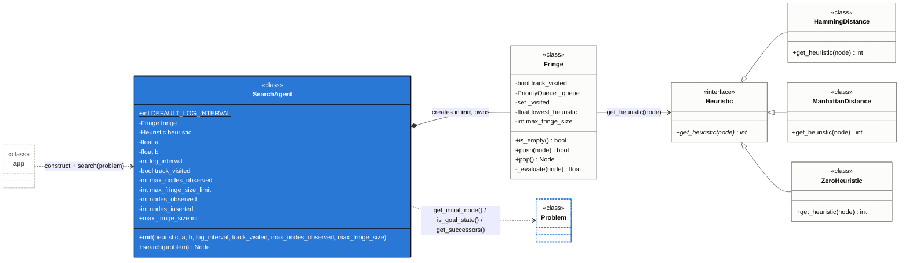

# Agent model: `SearchAgent`, `Fringe`, and `Heuristic`

How the search itself is implemented, and why `Fringe`/`Heuristic` are
internal helpers rather than something a caller (`app.py`) works with
directly.

## Diagram

`SearchAgent` is the **main class** — the only thing `app.py` constructs and
calls (`SearchAgent(...).search(problem)`, see [APP_WORKFLOW.md](APP_WORKFLOW.md)).
`Fringe` and `Heuristic` are **internal helpers**: `SearchAgent` builds its
own `Fringe` in `__init__` and never exposes it, and although a `Heuristic`
instance is handed in from outside, only `Fringe` ever calls it during the
search loop. `Problem` is the one *external* collaborator `SearchAgent` talks
to directly — it's the `problem` argument passed into `search()`, not
something `SearchAgent` owns or constructs (see [ENVIRONMENT_MODEL.md](ENVIRONMENT_MODEL.md)).

## `SearchAgent` — the main class

`app.py` only ever does two things with a `SearchAgent`: construct one per
configuration line (`heuristic, a, b, log_interval, track_visited,
max_nodes_observed, max_fringe_size`), then call `agent.search(problem)`
once. Everything about *how* nodes get ordered, deduplicated, or evaluated is
invisible from that call site — `search()` takes a `Problem` in and returns a
goal `Node` out (or raises `NoSolutionError`, either because the board is
unsolvable or because `max_nodes_observed`/`max_fringe_size` was exceeded
first). `a`/`b` select the effective strategy purely by weighting
`f(n) = a*g(n) + b*h(n)`: `a=1,b=0` behaves like Dijkstra, `a=0,b=1` like
Greedy, `a=1,b=1` like plain A*, `a=1,b>1` like weighted A* — there's no
separate per-strategy code path.

## `SearchAgent` and `Problem`

`search()`'s main loop is really a conversation between `SearchAgent` and the
`problem` it was given — every iteration calls back into it:

| Call | When |
|---|---|
| `problem.get_initial_node()` | Once, before the loop, to seed the fringe. |
| `problem.is_goal_state(node)` | Every iteration, on the node `Fringe.pop()` just returned. |
| `problem.get_successors(node)` | Every iteration where that node wasn't the goal. |

Unlike `Fringe`/`Heuristic`, `SearchAgent` doesn't create or own its
`Problem` — it's handed one as `search()`'s argument and only calls the three
methods above on it. That's also why `Problem` isn't a "helper": it's the
external interface `SearchAgent` is written against, not a piece of the
search algorithm itself (see [ENVIRONMENT_MODEL.md](ENVIRONMENT_MODEL.md) for
`Problem`'s own side of that contract).

## `Fringe` and `Heuristic` — internal helpers

Neither class is meant to be used on its own:

- **`Fringe`** is created once, inside `SearchAgent.__init__`
  (`self.fringe = Fringe(self.heuristic, a, b, track_visited=track_visited)`),
  and never handed back out. `search()`'s main loop only ever calls
  `self.fringe.push(...)` and `self.fringe.pop()` — the priority queue, the
  visited-set dedup (togglable via `track_visited`), and the `f(n)` math in
  `_evaluate` are all private to `Fringe`.
- **`Heuristic`** (and its three concrete implementations,
  `HammingDistance`/`ManhattanDistance`/`ZeroHeuristic`) is the one collaborator that *is*
  constructed outside `SearchAgent` — `app.py`'s `resolve_configurations`
  picks one per configuration line. But once it's passed into
  `SearchAgent.__init__`, it's `Fringe`, not `SearchAgent`, that actually
  calls `get_heuristic(node)` during the search loop (inside `_evaluate`).
  `SearchAgent` itself calls it directly exactly once, outside the loop: on
  the goal node, to log `h(n)` alongside the final result.

So from `app.py`'s perspective, `Fringe` and `Heuristic` are implementation
details of "how `SearchAgent` searches" — swapping the priority-queue
implementation or adding a new heuristic subclass never changes how
`SearchAgent` is called.

See [ARCHITECTURE.md](ARCHITECTURE.md) for the full class diagram, per-method
reference, and the "Search workflow" flowchart of `search()`'s control flow,
and [SEARCH_ACTIVITY.md](SEARCH_ACTIVITY.md) for a sequence diagram of the
same call showing exactly which object messages which other object.
