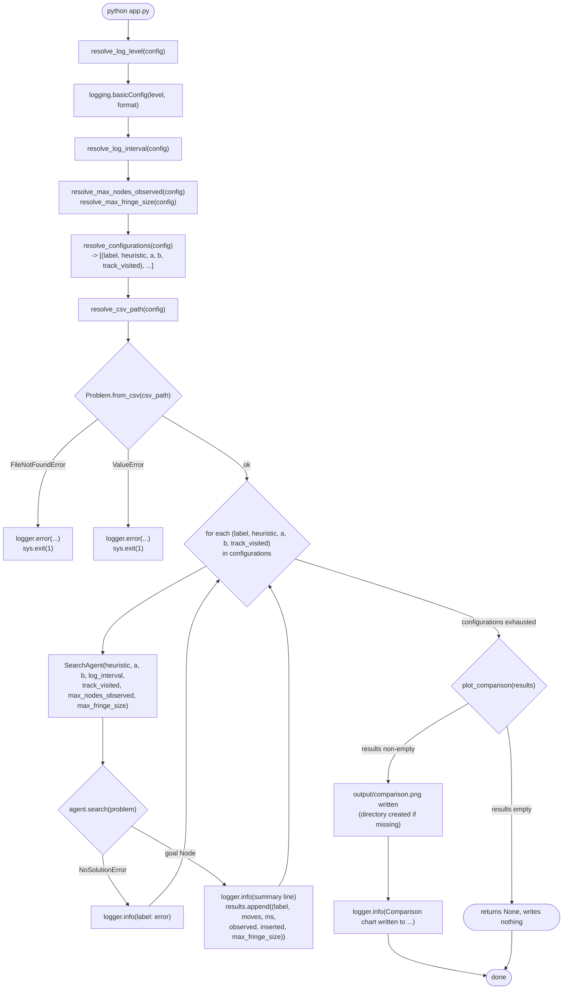

# How `app.py` works

The entry-point script's own control flow — every function it calls, in
order, and what each branch does. For where this fits in the broader
input/processing/output picture see [SYSTEM_ARCHITECTURE.md](SYSTEM_ARCHITECTURE.md);
for what it's calling into, see [ENVIRONMENT_MODEL.md](ENVIRONMENT_MODEL.md) and
[AGENT_MODEL.md](AGENT_MODEL.md).

## Reading the flow

1. **Config resolution, before anything else runs.** `resolve_log_level`,
   `resolve_log_interval`, `resolve_max_nodes_observed`,
   `resolve_max_fringe_size`, `resolve_configurations`, and
   `resolve_csv_path` are all read from the same `input/config.ini`
   (`DEFAULT_CONFIG_PATH`). `logging.basicConfig` is called immediately
   after the log level is known, so every subsequent step — including
   problem loading — logs at the configured level. Each `resolve_*`
   function has its own fallback and never raises (see
   [CONFIGURATION.md](CONFIGURATION.md)), so this stage can't itself abort
   the run. Unlike the two search-effort limits (shared by every
   configuration in the run), `track_visited` comes back as part of each
   `resolve_configurations` tuple — it's set per configuration line, not
   globally.

2. **Loading the board is the first thing that can fail fatally.**
   `Problem.from_csv` is the only call in this script wrapped in a
   try/except that calls `sys.exit(1)` — a missing or malformed CSV stops
   the whole run before any searching happens, since every configuration
   would need the same `problem`.

3. **One `SearchAgent` per configuration line.** The loop body is a fresh
   `SearchAgent(heuristic, a, b, log_interval, track_visited=..., max_nodes_observed=...,
   max_fringe_size=...)` per iteration — agents are not reused across
   configurations. The two search-effort limits are the same for every
   configuration in a run, but `track_visited` is that configuration line's
   own value (defaulting to `True` if the line didn't specify one), so
   different lines can mix tracked and untracked search in the same run.
   Each iteration ends with a single `agent.search(problem)` call;
   `NoSolutionError` is caught per-iteration (logged, then the loop
   continues), whether it's because the board is unsolvable or because a
   configured limit was exceeded; it does not stop the other configurations
   from running.

4. **Results only accumulate for configurations that solved.** Each
   successful `search()` appends a `(label, path_cost, elapsed_ms,
   nodes_observed, nodes_inserted, max_fringe_size)` tuple — exactly the
   shape `plot_comparison` expects (see [ARCHITECTURE.md](ARCHITECTURE.md)).

5. **Charting is the only step gated on there being anything to show.**
   `plot_comparison` returns `None` (writing nothing) if every configuration
   raised `NoSolutionError`; otherwise it writes `output/comparison.png` and
   the final log line reports the path.
