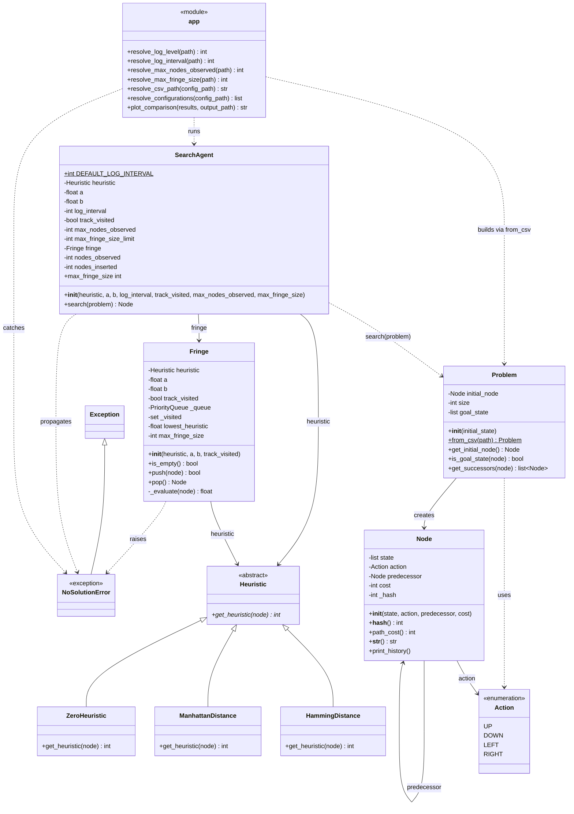
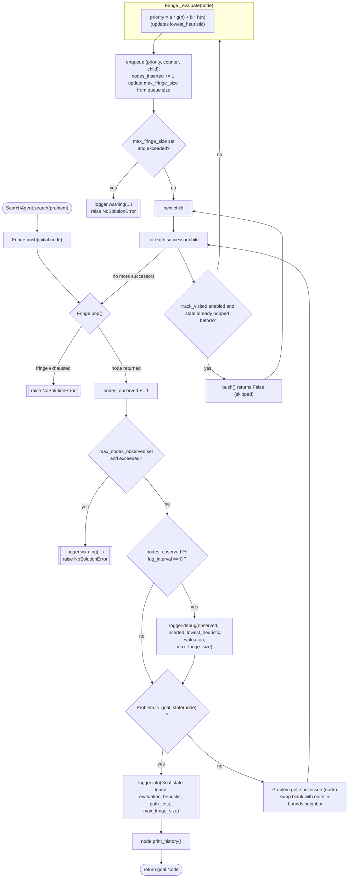

# Architecture & class reference

## Diagrams

### Class diagram

Covers the whole program (`app.py`'s module-level functions included as a `<<module>>` box; tests excluded).

### Search workflow

How `SearchAgent.search()` drives `Problem`/`Fringe`/`Node` to find (or fail to find) a solution. There's no separate "algorithm" concept — `Fringe._evaluate` always computes the single weighted formula `f(n) = a*g(n) + b*h(n)`; choosing `a`/`b` is what makes a given run behave like Dijkstra (`a=1,b=0`), Greedy (`a=0,b=1`), plain A* (`a=1,b=1`), or weighted A* (`a=1,b>1`).

---

## `Action.py`

### `class Action(Enum)`
Move the blank tile can make on the puzzle board.

| Member | Value |
|---|---|
| `UP` | `"up"` |
| `DOWN` | `"down"` |
| `LEFT` | `"left"` |
| `RIGHT` | `"right"` |

---

## `Node.py`

### `class Node`
A single puzzle state, the action that produced it, and a link to its predecessor.

| Function | Description |
|---|---|
| `__init__(self, state, action=None, predecessor=None, cost=0)` | Store the board state, the action that led to it, its predecessor node, and its cost; precompute its hash. |
| `__hash__(self)` | Return the hash of the board state, precomputed once at construction, used as the visited-set key. |
| `path_cost(self)` | `g(n)`: number of moves from the initial node to this node. |
| `__str__(self)` | Format the action that led to this node and its board state for printing. |
| `print_history(self)` | Print the full path from the root node to this node, oldest first, by recursing into the predecessor before printing itself. |

---

## `Problem.py`

### `class Problem`
The 15-puzzle: initial state, goal test, and successor generation.

| Function | Description |
|---|---|
| `__init__(self, initial_state)` | Wrap the given board state as the initial `Node`, and precompute the board size and the solved goal board. |
| `from_csv(cls, path)` *(classmethod)* | Build a `Problem` from a CSV file holding the initial board configuration. Raises `FileNotFoundError` if `path` doesn't exist, and `ValueError` if the CSV isn't a square grid or doesn't contain each value `0..size*size-1` exactly once. |
| `get_initial_node(self)` | Return the root node of the search. |
| `is_goal_state(self, node)` | Check whether the node's state matches the precomputed goal board (`1..N-1` then blank). |
| `get_successors(self, node)` | Generate the nodes reachable from `node` by sliding a neighboring tile into the blank into a shallow copy of the board; each successor carries the `Action` taken, `node` as its predecessor, and `node`'s cost plus one. |

---

## `Heuristic.py`

### `class Heuristic(ABC)`
Common interface for search heuristics used to estimate distance to the goal.

| Function | Description |
|---|---|
| `get_heuristic(self, node)` *(abstract)* | Estimate the cost from `node`'s state to the goal state. |

---

## `ManhattanDistance.py`

### `class ManhattanDistance(Heuristic)`
Sum of each tile's horizontal + vertical distance from its goal position.

| Function | Description |
|---|---|
| `get_heuristic(self, node)` | Compute the total Manhattan distance of all tiles from their goal cells. |

---

## `HammingDistance.py`

### `class HammingDistance(Heuristic)`
Count of tiles that are not already in their goal position.

| Function | Description |
|---|---|
| `get_heuristic(self, node)` | Compute the number of misplaced tiles compared to the goal state. |

---

## `ZeroHeuristic.py`

### `class ZeroHeuristic(Heuristic)`
Always estimates a distance of 0, regardless of state.

| Function | Description |
|---|---|
| `get_heuristic(self, node)` | Return `0` unconditionally, making `f(n)` depend only on `g(n)`. |

---

## `NoSolutionError.py`

### `class NoSolutionError(Exception)`
Raised by `Fringe.pop` when the fringe empties without reaching the goal.

---

## `Fringe.py`

### `class Fringe`
Open-set for search: a priority queue ordered by the weighted evaluation function `f(n) = a*g(n) + b*h(n)`. Choosing `a`/`b` selects the effective strategy — `a=1,b=0` behaves like Dijkstra, `a=0,b=1` like Greedy, `a=1,b=1` like plain A*, `a=1,b>1` like weighted A*. When `track_visited` is enabled (the default), also tracks which states have already been popped, so `pop` never returns the same state twice even if it was pushed onto the fringe more than once; disabling it allows a state to be pushed/popped more than once. Also tracks the lowest heuristic value seen so far, and the largest the underlying queue has ever grown to (`max_fringe_size`) — a proxy for the search's peak memory use.

| Function | Description |
|---|---|
| `__init__(self, heuristic, a=1.0, b=1.0, track_visited=True)` | Store the heuristic/weights/`track_visited` flag, create the underlying priority queue and visited set, and initialize `lowest_heuristic` to infinity and `max_fringe_size` to `0`. |
| `is_empty(self)` | Whether there is anything left to explore. |
| `push(self, node)` | Add a node to the fringe, ordered by its evaluation. If `track_visited` is enabled, skips (and returns `False` for) a state that's already been popped; returns `True` if actually inserted. Updates `max_fringe_size` from the queue's size (including any not-yet-discarded stale duplicates) after a genuine insertion. |
| `pop(self)` | Remove and return the next node. If `track_visited` is enabled, skips and marks visited so no state is returned twice; if disabled, the visited set is bypassed entirely. Raises `NoSolutionError` once the fringe is exhausted without finding one. |
| `_evaluate(self, node)` | `f(n) = a*g(n) + b*h(n)`. Raises `TypeError` if `heuristic` is `None`. Updates `lowest_heuristic` with `h(n)`. |

---

## `SearchAgent.py`

### `class SearchAgent`
Searches a `Problem`'s state space, ordered by `f(n) = a*g(n) + b*h(n)`. Uses the module-level `logging.getLogger(__name__)` logger: logs its configuration once at construction (`DEBUG`), emits a `DEBUG`-level progress message (nodes observed/inserted, the lowest heuristic seen so far, the current node's evaluation `f(n)`, via `Fringe._evaluate`, and the peak fringe size so far) every `log_interval` loop iterations during `search()`, and logs an `INFO`-level message (evaluation, heuristic, path cost, peak fringe size) plus the goal node's full path history once a goal state is found. If `max_nodes_observed`/`max_fringe_size` is configured and exceeded, logs a `WARNING` message naming the limit and raises `NoSolutionError` with a matching message.

| Function | Description |
|---|---|
| `__init__(self, heuristic=None, a=1.0, b=1.0, log_interval=None, track_visited=True, max_nodes_observed=None, max_fringe_size=None)` | Pick a default heuristic (`ManhattanDistance`), store the `a`/`b` evaluation-function weights, `log_interval` (defaulting to `DEFAULT_LOG_INTERVAL`, `50_000`), `track_visited`, and the `max_nodes_observed`/`max_fringe_size` limits (`None` = unlimited), set up the `Fringe` (forwarding `track_visited`), and log the resulting configuration at `DEBUG` level. |
| `max_fringe_size` *(property)* | The largest number of nodes the `Fringe` has held at any one time during `search()`; proxies `self.fringe.max_fringe_size`. Not to be confused with the `max_fringe_size` constructor argument, which is the configured upper limit. |
| `search(self, problem)` | Run the search over `problem`: push its initial node onto the fringe; loop popping the next node (the `Fringe` raises `NoSolutionError` once exhausted; if `track_visited` is enabled it's also the next not-yet-visited one), logging a `DEBUG` progress message every `log_interval` iterations. After each pop, raises `NoSolutionError` (logged at `WARNING`) if `max_nodes_observed` is exceeded; after each successful push, raises `NoSolutionError` (logged at `WARNING`) if `max_fringe_size` is exceeded. Once the popped node is the goal, logs an `INFO` message with its evaluation/heuristic/path cost/peak fringe size, prints its full move history via `Node.print_history`, and returns it; otherwise pushes its successors. The `Fringe`, visited set, and node counters are still created once in `__init__` and not reset here, so a given `SearchAgent` instance is still meant for a single `search()` call. |

---

## `app.py`

Entry point script. Reads the logging level, log interval, search-effort limits, which SearchAgent configurations to run (each with its own heuristic/weights/`track_visited`), and which puzzle CSV to load from `input/config.ini` via `resolve_log_level`/`resolve_log_interval`/`resolve_max_nodes_observed`/`resolve_max_fringe_size`/`resolve_configurations`/`resolve_csv_path`, and configures `logging.basicConfig` before anything else runs. Loads the chosen board via `Problem.from_csv`, reporting `FileNotFoundError`/`ValueError` if the file is missing or invalid. Then runs a `SearchAgent` per resolved configuration, printing each run's move count, elapsed time, and node counts (or the `NoSolutionError` message if a configuration finds no solution, or exceeds a configured limit), and finally renders `plot_comparison`'s chart across every configuration that solved.

| Function | Description |
|---|---|
| `_read_config(path)` | Parse an ini config file, treating trailing `# ...`/`; ...` text on a line as a comment. |
| `_preserve_case(optionstr)` | Identity function used as a `ConfigParser.optionxform` override, so `[searchagents]` labels keep their original case instead of being lowercased. |
| `_parse_track_visited(value)` | Coerce a configuration line's `track_visited` field to `bool`: passes an already-`bool` value through (used by `DEFAULT_CONFIGURATIONS`), otherwise looks the string up in `ConfigParser.BOOLEAN_STATES` (case-insensitive `true`/`false`, `yes`/`no`, `on`/`off`, `1`/`0`). Raises `KeyError` for an unrecognized string. |
| `resolve_log_level(path)` | Read the `[generalsettings] level` value from an ini config file. Falls back to `DEFAULT_LOG_LEVEL` (`"WARNING"`) if the file/section/key is missing, and to `logging.WARNING` if the level name isn't a recognized `logging` constant. Never raises. |
| `resolve_log_interval(path)` | Read the `[generalsettings] log_interval` value from an ini config file. Falls back to `DEFAULT_LOG_INTERVAL` (`SearchAgent.DEFAULT_LOG_INTERVAL`, `50_000`) if the file/section/key is missing or the value isn't a positive integer. Never raises. |
| `resolve_max_nodes_observed(path)` | Read the `[generalsettings] max_nodes_observed` value from an ini config file: the upper limit on nodes a `SearchAgent` may observe before `search()` raises `NoSolutionError`. Falls back to `None` (no limit) if the file/section/key is missing, blank, or not a positive integer. Never raises. |
| `resolve_max_fringe_size(path)` | Read the `[generalsettings] max_fringe_size` value from an ini config file: the upper limit on the fringe's peak size before `search()` raises `NoSolutionError`. Falls back to `None` (no limit) if the file/section/key is missing, blank, or not a positive integer. Never raises. |
| `resolve_csv_path(config_path)` | Read the `[problem] state` value from an ini config file as a literal CSV path to load. Falls back to `DEFAULT_CSV_PATH` if the file/section/key is missing or empty. Never raises. |
| `resolve_configurations(config_path)` | Read `[searchagents]` from an ini config file: one `SearchAgent` setup per line, as `label = heuristic, a, b` or `label = heuristic, a, b, track_visited` (`heuristic` is `hamming`/`manhattan`/`zero`/blank, `a`/`b` weight `f(n) = a*g(n) + b*h(n)`, `track_visited` defaults to `True` if the 4th field is omitted). Returns a list of `(label, Heuristic instance or None, a, b, track_visited)` tuples in file order. Falls back to `DEFAULT_CONFIGURATIONS` if the section is missing/empty/entirely invalid; a single bad line (wrong field count, bad heuristic, non-numeric `a`/`b`, or unrecognized `track_visited`) is skipped (with a warning printed) rather than discarding the rest. Never raises. |
| `plot_comparison(results, output_path=DEFAULT_CHART_PATH)` | Render a small-multiples horizontal-bar-chart comparison of every solved configuration: one subplot each for moves, time, nodes observed, nodes inserted, and max fringe size, since those metrics live on incompatible scales and so can't share an axis. `results` is a list of `(label, path_cost, elapsed_ms, nodes_observed, nodes_inserted, max_fringe_size)` tuples. Saves to `output_path` and returns it, or returns `None` (writing nothing) if `results` is empty. |

## `requirements.txt`

The one external dependency: `matplotlib`, used only by `plot_comparison`. Install with `pip install -r requirements.txt`. Everything else in the project is standard library.

## `output/comparison.png`

The chart `plot_comparison` writes at the end of a run (`DEFAULT_CHART_PATH`, `output/comparison.png`; the `output/` directory is created automatically if it doesn't exist): a 2x3 grid of horizontal-bar subplots (moves, time, nodes observed, nodes inserted, max fringe size; the sixth cell is left blank), one bar per solved configuration, in the order they appear in `input/config.ini`. Each bar carries a direct value label at its tip; bars use a single accent hue since each subplot is one series (no legend needed). Configurations that raised `NoSolutionError` are excluded (there's nothing to plot for them).

See [CONFIGURATION.md](CONFIGURATION.md) for `input/config.ini` and `input/` board details, [SYSTEM_ARCHITECTURE.md](SYSTEM_ARCHITECTURE.md) for the input/processing/output pipeline view, [ENVIRONMENT_MODEL.md](ENVIRONMENT_MODEL.md) for `Problem`/`Node`/`Action` as an interface built on a foundation, [AGENT_MODEL.md](AGENT_MODEL.md) for `SearchAgent`/`Fringe`/`Heuristic` as a main class with internal helpers, [APP_WORKFLOW.md](APP_WORKFLOW.md) for `app.py`'s own control flow, [SEARCH_ACTIVITY.md](SEARCH_ACTIVITY.md) for a class-interaction sequence diagram of `search()`, and [TESTING.md](TESTING.md) for the test suite reference.
