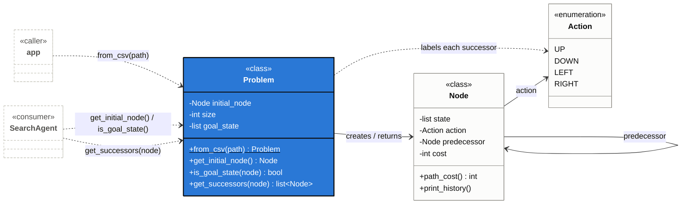

# Environment model: `Problem`, `Node`, and `Action`

How the 15-puzzle's state space is represented, and why `Problem` is the only
part of it `SearchAgent` (see [AGENT_MODEL.md](AGENT_MODEL.md)) ever talks
to directly.

## Diagram

`Problem` is the **interface** — the only class `SearchAgent` calls into.
`Node` and `Action` are **foundational**: they don't do anything on their
own, but `Problem`'s three methods are built entirely out of them (`Node` is
what `Problem` constructs and hands back; `Action` is just a tag `Node`
carries). The arrow coming in from the left is `app.py` ([APP_WORKFLOW.md](APP_WORKFLOW.md))
calling the `from_csv(path)` classmethod, which is how a `Problem` instance
comes into existence in the first place — `SearchAgent` never constructs one
itself, only receives it as `search()`'s argument.

## `Problem` — the interface

`SearchAgent.search()` ([AGENT_MODEL.md](AGENT_MODEL.md)) never looks at a
board directly. It only ever calls three `Problem` methods:

| Method | What `SearchAgent` uses it for |
|---|---|
| `get_initial_node()` | Seed the fringe once, at the start of `search()`. |
| `is_goal_state(node)` | Decide whether to stop and return the popped node. |
| `get_successors(node)` | Expand a non-goal node into its neighbors to push. |

Because that's the entire contract, `Problem` could be swapped for a
different puzzle representation (a different board size, a different
adjacency rule) without `SearchAgent`, `Fringe`, or `Heuristic` changing at
all — none of them know or care how a state is stored, only that `Problem`
can hand them a `Node` and answer "is this the goal?" / "what's next?". Two
things live behind that interface but are precomputed once, in `__init__`,
rather than on every call: the board `size`, and the solved `goal_state` used
by `is_goal_state`.

## `Node` and `Action` — the foundation

`Problem` doesn't invent a graph structure separately from `Node` — `Node`
*is* the search-space graph:

- Each `Node` is a vertex: a board `state` plus its `cost` (`g(n)`, the
  number of moves from the root).
- Each `Node`'s `predecessor` link is the edge back toward the root, so
  `get_successors` growing the graph forward one call at a time is exactly
  the same thing as `print_history` walking it backward one link at a time
  once a goal is found.
- The graph is discovered lazily, not built up front: `Problem.get_successors`
  only materializes a node's neighbors when `SearchAgent` actually asks for
  them.

`Action` is not a separate mechanism — it's an attribute of `Node`. When
`get_successors` swaps the blank tile with a neighbor, it tags the resulting
`Node` with whichever `Action` (`UP`/`DOWN`/`LEFT`/`RIGHT`) produced it. That
tag has exactly two consumers, both on `Node` itself: `__str__` (prints it)
and, transitively, `print_history` (prints it once per node in the solution
path).

See [ARCHITECTURE.md](ARCHITECTURE.md) for the full class diagram and
per-method reference across the whole program, and
[AGENT_MODEL.md](AGENT_MODEL.md) for how `SearchAgent` drives `Problem`
through a full search.
