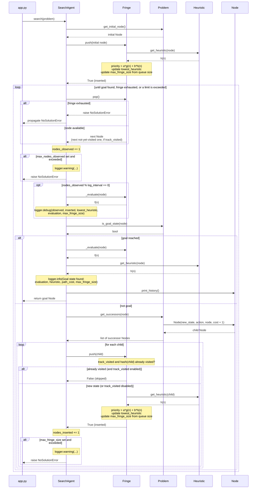

# Search activity: class interaction for `SearchAgent.search()`

While the "Search workflow" flowchart in [ARCHITECTURE.md](ARCHITECTURE.md#search-workflow)
shows the *control flow* of one `search()` call, this diagram shows the same
call as an **activity/interaction diagram between classes** — which object
sends which message to which other object, in order.

Participants:

| Participant | Class | Role |
|---|---|---|
| `App` | `app.py` | Caller; owns the loop over configurations. |
| `SA` | `SearchAgent` | Drives the search loop. |
| `FR` | `Fringe` | Priority-queue open set; evaluates and orders nodes. |
| `PR` | `Problem` | Goal test and successor generation. |
| `HE` | `Heuristic` | `HammingDistance`, `ManhattanDistance`, or `ZeroHeuristic`; estimates `h(n)`. |
| `ND` | `Node` | A single board state plus the action/predecessor/cost that produced it. |

## Reading this against the flowchart

Both diagrams describe the same call; they answer different questions:

- [ARCHITECTURE.md](ARCHITECTURE.md#search-workflow)'s flowchart — "what
  branch does execution take next?" (loop-exit conditions, goal test,
  log-interval check).
- This diagram — "which class asked which other class to do something?"
  (during the main loop, `SearchAgent` never computes a heuristic itself; it
  goes through `Fringe`, which is the only class that talks to `Heuristic`
  during node evaluation).

Every `Node` is constructed by `Problem` (the initial one in
`get_initial_node`, successors in `get_successors`); `SearchAgent` only ever
holds references to the ones `Problem`/`Fringe` hand it. The one exception is
the goal node: once found, `SearchAgent` calls `Heuristic.get_heuristic` and
`Node.print_history` on it directly to report the result, rather than going
through `Fringe`/`Problem`.

See [SYSTEM_ARCHITECTURE.md](SYSTEM_ARCHITECTURE.md) for where this call fits
in the overall input → processing → output pipeline, and
[AGENT_MODEL.md](AGENT_MODEL.md) for why `Fringe`/`Heuristic` are internal
helpers to `SearchAgent` rather than something callers use directly.
