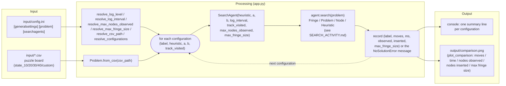

# System architecture (input → processing → output)

A system-level view of one run of `python app.py`: what goes in, what does the
work, and what comes out. For the code-level class diagram and the
`SearchAgent.search()` control flow, see [ARCHITECTURE.md](ARCHITECTURE.md);
for the class-to-class interaction during a search, see
[SEARCH_ACTIVITY.md](SEARCH_ACTIVITY.md).

## Input

| Source | Role |
|---|---|
| [`input/config.ini`](../input/config.ini) `[generalsettings]` | Console log level, how often `SearchAgent.search()` logs progress, and optional `max_nodes_observed`/`max_fringe_size` search-effort limits. |
| `input/config.ini` `[problem]` | Which board CSV to load (`state` key). |
| `input/config.ini` `[searchagents]` | Which `SearchAgent` setups to run — one `label = heuristic, a, b` line each, each optionally ending in its own `track_visited` field. |
| `input/*.csv` | The puzzle board itself: an `N x N` grid of tile values, `0` = blank. |

Full reference: [CONFIGURATION.md](CONFIGURATION.md).

## Processing

`app.py` is the only piece that touches both the config file and the solver:

1. Resolve logging level/interval, the search-effort limits
   (`max_nodes_observed`/`max_fringe_size`), the CSV path, and the list of
   configurations (each with its own heuristic/weights/`track_visited`) from
   `input/config.ini` (each `resolve_*` function falls back to a sensible
   default rather than raising if something is missing or malformed).
2. Load the board once via `Problem.from_csv`, shared across every configuration.
3. For each configuration, build a fresh `SearchAgent` (the two limits are the
   same every iteration; `track_visited` is that configuration's own value)
   and call `search()` — this is where the actual informed-search algorithm
   runs (see [SEARCH_ACTIVITY.md](SEARCH_ACTIVITY.md) for what happens inside
   that call).
4. Collect either the solved result (moves, elapsed time, node counts, peak
   fringe size) or the `NoSolutionError` message — raised either because the
   board is unsolvable or because a configured limit was exceeded first — per
   configuration.

## Output

| Sink | Content |
|---|---|
| Console | One line per configuration: moves, elapsed time, nodes observed, nodes inserted, max fringe size — or the `NoSolutionError` message if that configuration's board has no solution reachable from the fringe, or a configured `max_nodes_observed`/`max_fringe_size` limit was exceeded first. |
| `output/comparison.png` | A 2x3 grid of horizontal-bar subplots (moves, time, nodes observed, nodes inserted, max fringe size; one cell left blank), one bar per *solved* configuration, written by `plot_comparison` (the `output/` directory is created automatically if missing). Configurations that raised `NoSolutionError` are excluded. |

See [ARCHITECTURE.md](ARCHITECTURE.md) for the full class reference,
[APP_WORKFLOW.md](APP_WORKFLOW.md) for `app.py`'s own step-by-step control
flow, [ENVIRONMENT_MODEL.md](ENVIRONMENT_MODEL.md) and [AGENT_MODEL.md](AGENT_MODEL.md)
for the two collaborator groups `app.py` drives, and [TESTING.md](TESTING.md)
for how this pipeline is tested.
